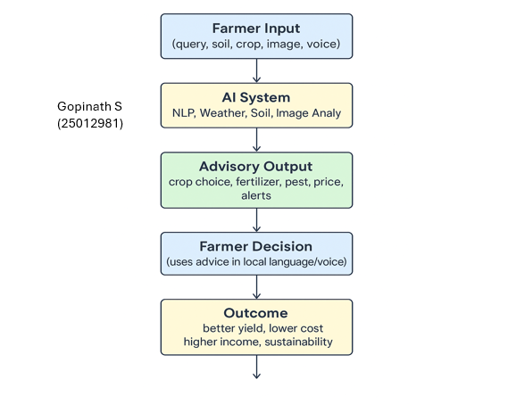

# Smart India Hackathon Workshop
# Date:28/9/2025
## Register Number:
## Name:
## Problem Title
SIH 25010: Smart Crop Advisory System for Small and Marginal Farmers
## Problem Description
A majority of small and marginal farmers in India rely on traditional knowledge, local shopkeepers, or guesswork for crop selection, pest control, and fertilizer use. They lack access to personalized, real-time advisory services that account for soil type, weather conditions, and crop history. This often leads to poor yield, excessive input costs, and environmental degradation due to overuse of chemicals. Language barriers, low digital literacy, and absence of localized tools further limit their access to modern agri-tech resources.

Impact / Why this problem needs to be solved

Helping small farmers make informed decisions can significantly increase productivity, reduce costs, and improve livelihoods. It also contributes to sustainable farming practices, food security, and environmental conservation. A smart advisory solution can empower farmers with scientific insights in their native language and reduce dependency on unreliable third-party advice.

Expected Outcomes

• A multilingual, AI-based mobile app or chatbot that provides real-time, location-specific crop advisory.
• Soil health recommendations and fertilizer guidance.
• Weather-based alerts and predictive insights.
• Pest/disease detection via image uploads.
• Market price tracking.
• Voice support for low-literate users.
• Feedback and usage data collection for continuous improvement.

Relevant Stakeholders / Beneficiaries

• Small and marginal farmers
• Agricultural extension officers
• Government agriculture departments
• NGOs and cooperatives
• Agri-tech startups

Supporting Data

• 86% of Indian farmers are small or marginal (NABARD Report, 2022).
• Studies show ICT-based advisories can increase crop yield by 20–30%.

## Problem Creater's Organization
Government of Punjab

## Theme
Agriculture, FoodTech & Rural Development

## Proposed Solution
<h3>Farmer app</h3>
<ul><li>The proposed solution is to develop a smart advisory system that provides personalized, real-time advice to small and marginal farmers. </li>
<li>his system will use AI, machine learning, and data analytics to provide location-specific crop advisory, soil health recommendations, and weather-based alerts.

</li>
<li>it accept and speak all language so it easy to understand</li></ul>

## Technical Approach
<h3>TECHINICAL APPROACH</h3>
<ul><li>Technologies: Python, TensorFlow, Keras, OpenCV, and React Native for mobile app development.
 Methodology: Data collection from various sources, data preprocessing, model training, and deployment.
it is build with programming language so it does not have ang malfunction
 <b></b></li></ul>

## Feasibility and Viability
<h3>FEASIBILITY and VIABILITY.</h3>
<ul><li>Analysis: The solution is feasible with existing technologies and can be implemented in phases.</li>
<li>Potential challenges: Data quality, user adoption, and scalability.</li>
<li> Strategies: Collaborate with government agencies, NGOs, and agri-tech startups to ensure data quality and user adoption.</li></ul>

## Impact and Benefits
<h3>IMPACT AND BENEFITS</h3>
<ul><li>Potential impact: Increased productivity, reduced costs, and improved livelihoods for small and marginal farmers.</li>
<li>Benefits: Social (improved livelihoods), economic (increased productivity and reduced costs), and environmental (sustainable farming practices).</li></ul>

## Research and References
<h3>RESEARCH AND REFERENCES</h3>
<ul><li>NABARD Report (2022): 86% of Indian farmers are small or marginal. - Studies: ICT-based advisories can increase crop yield by 20-30%.</li></ul>
